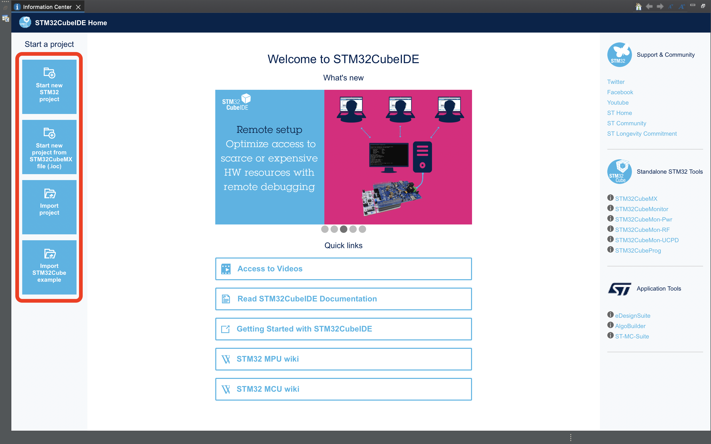
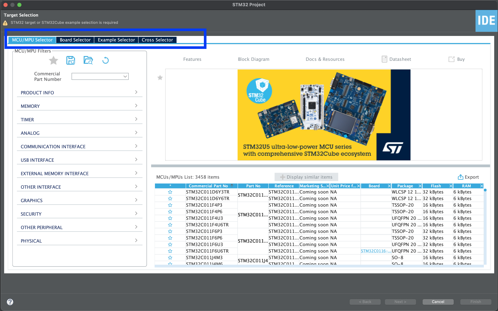
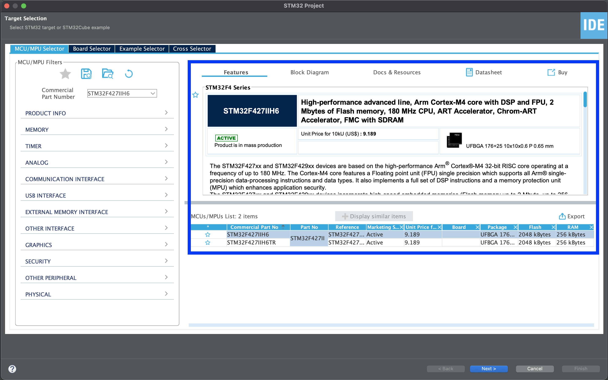

# CubeIDE的界面

## 1. 创建工程

上图即欢迎界面，图中红框提供了创建工程的四种方式。注意工程项目通常有个配置文件，即.ioc文件。

点击新建项目，就会出现如图所示的处理器芯片选择。左边的框可以根据实际需要（比如内存大小、时钟、外设啥的）挑选微处理器芯片，下面的框则是芯片的各项参数。蓝色方框标注的其他选项卡中的设置一般不需要设置，除非你有ST官方的开发板。

我们以**STM32F427IIH6**芯片为例，展示CubeIDE的开发界面。

图中蓝色方框里就是芯片特性、参数的简要概括，另外选项卡还提供文档、数据表等资源。

点击下一步之后，就会出现项目配置对话框。可以在options里选择目标语言、二进制文件类型、目标工程类型。

其中在二进制文件类型框中，可以选择生成静态库文件。可执行文件和静态库文件的关系如下图所示。

选择好后，就是极为复杂的工程界面了。

工程界面的每个子窗体的位置都不是固定的，说不定哪天就划拉没了。

一个基本的分析方法：关闭所有小窗体（就是把带X号的全关了），然后在Window->Show View里面逐个打开试试。如果关闭了文本编辑器（没错，这文本编辑器还可以以图形界面的方式配置.ioc文件），可以在Project Explorer里面随便打开一个源文件找到它。

## 2. 子窗体介绍

